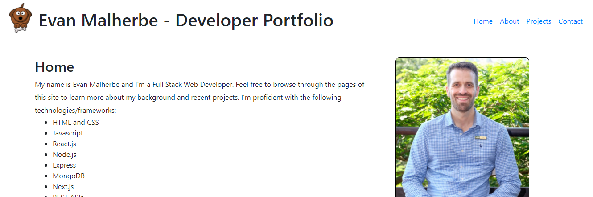
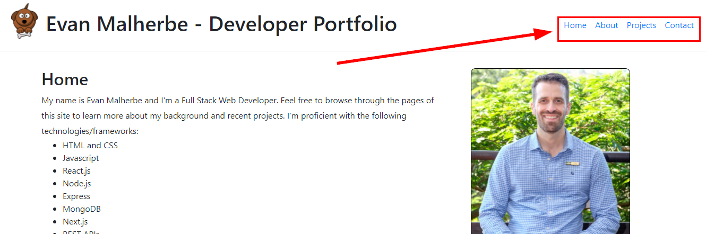

# HyperionDev Full Stack Web Development Bootcamp - Level 3 - Task 10 - Next.js app - Developer Portfolio

## Description

This app uses Next.js to create a Developer Portfolio of my various coding projects, as well as a bit of background about me (Evan Malherbe) and my educational and work history.

The deployed website can be found at: [https://developer-portfolio-taupe.vercel.app/](https://developer-portfolio-taupe.vercel.app/).

## Table of Contents

- [Instructions](#instructions)
- [Technologies](#technologies)
- [Installation](#installation)
- [Usage](#usage)
- [Credits](#credits)

## Instructions

These were the instructions I was given to guide me in this task:

**Follow these steps:**

- Create a Developer Portfolio using Next.js. Your developer portfolio should contain the following pages/components:
- About - this page will serve as an introduction to you as a developer – your educational history, your work history, who you are and what you’re passionate about.
- Projects - this page needs to contain your best work. You will want to show off diversity as much as possible here. You should have at least one project deployed to Heroku which you should be able to link to here (your previous Capstone Project). It may be a good idea to add some of your work to Github and link to those repositories from here.
- Contact - ultimately what you want is for a lead to see your portfolio and contact you so you should include your contact details (email address, telephone number etc).
- Besides the requirements listed above, your project should also adhere to the following criteria:
  - It should be styled using styled-jsx.
  - It should contain at least one static image.
  - It should contain a header component that the user can use to navigate to the different pages in your app.

### Technologies

This project uses:

- HTML
- Styled JSX
- Javascript
- Next.js
- Node
- React
- React Bootstrap

## Installation

To run this project, do the following:

1. Copy the project files to a directory called 'devportfolio' on your local machine.
2. Navigate to this directory from the command line interface. E.g. cd c:/devportfolio.
3. In the command line interface type 'npm install'.
4. Once it has finished installing, type 'npm run dev'.
5. Open [http://localhost:3000](http://localhost:3000) to view the project in your web browser.

## Usage

1. Once you open the project in your browser [http://localhost:3000](http://localhost:3000), you will see a page with some information about my web development skills. See figure 1 below.

Figure 1

2. Click on any of the links in the top right hand section of the page to navigate to the other pages to see information about me, my projects and contact info. See figure 2 below.

Figure 2

## Credits

This project was created by Evan Malherbe as part of a task for HyperioDev Full Stack Development Bootcamp - December 2021 [GitHub profile](https://github.com/evanmalherbe)
